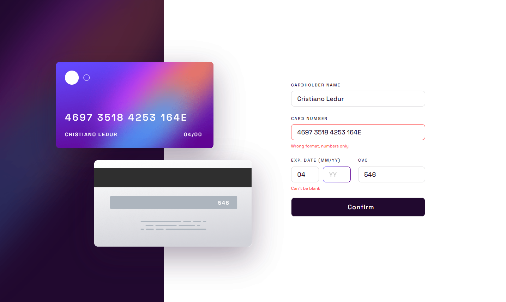

# Interactive Card - React



Em um primeiro momento este teste foi feito utilizando somente HTML, CSS e Javascript. Busquei replicar o mesmo utilizando React. Tomei tal caminho, pois, escolhi iniciar o projeto com as tecnologias as quais eu mais dominava.

> Caso tenha interesse em ver o teste feito apenas em HTML, CSS e Javascript, basta [clicar aqui](https://github.com/CristianoLedur/Interactive-Card) para vê-lo em outro repositório.

## 🚀 Acessando a interface

Para acessar a interface [clique aqui!](https://interactive-card-react.vercel.app/)

## ☕ Usando o projeto

Para usar o projeto, siga estas etapas:

* Clone o repositório

```
git clone https://github.com/CristianoLedur/Interactive-card-React.git
```

* Acesse a pasta do projeto
```
cd interactiveCard
```

* Instale as dependências

```
npm install
```

E pronto, você já pode sair fazendo ajustes e melhorias no projeto. 

## 📋 Tabela de tempo 

| Tarefa | Tempo estimado para realizacão (em minutos) | Tempo real (em minutos) | Data de conclusão | 
| --- | --- | --- | --- |
| Baixar os arquivos do Frontend Mentor | 5 | 3 | 05/04 | 
| Analisar o design | 15 | 10 | 05/04 | 
| Criar uma estrutura HTML | 20 | 23 | 06/04 | 
| Adicionar estilos CSS | 180 | 211 | 06/04 | 
| Implementar a responsividade | 120 | 195 | 07/04 | 
| Implementar a interatividade | 200 | 304 | 08/04 | 
| Testar a página em diferentes dispositivos | 60 | 25 | 09/04 | 
| Fazer ajustes finais no design | 30 | 45 | 09/04 |
| Replicar a estrutura utilizando React | 220 | 225 | 11/04 |
| Total (em minutos) | 850 | 1041 |

## Status

🎯 Concluído

[⬆ Voltar ao topo](#Interactive-card)<br>